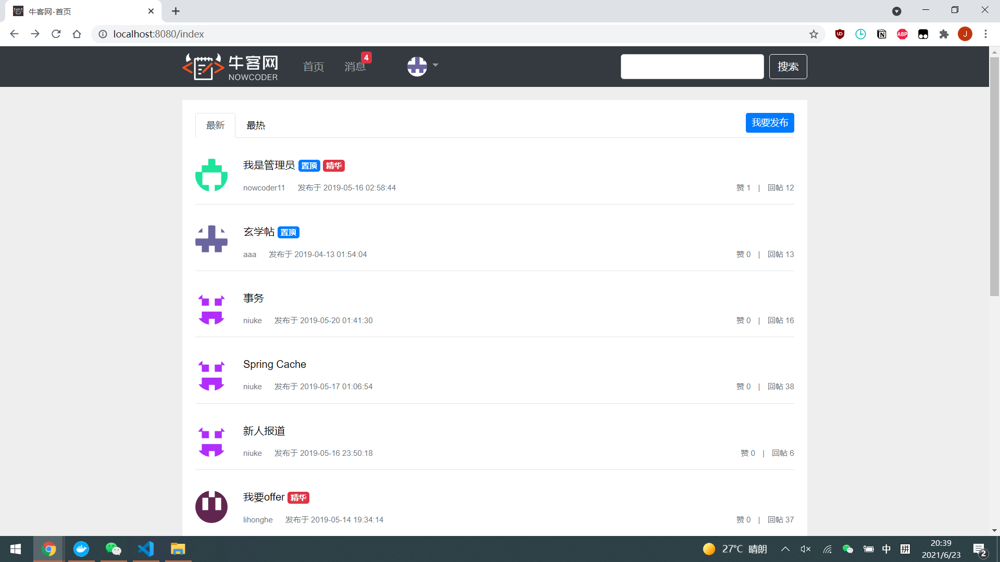
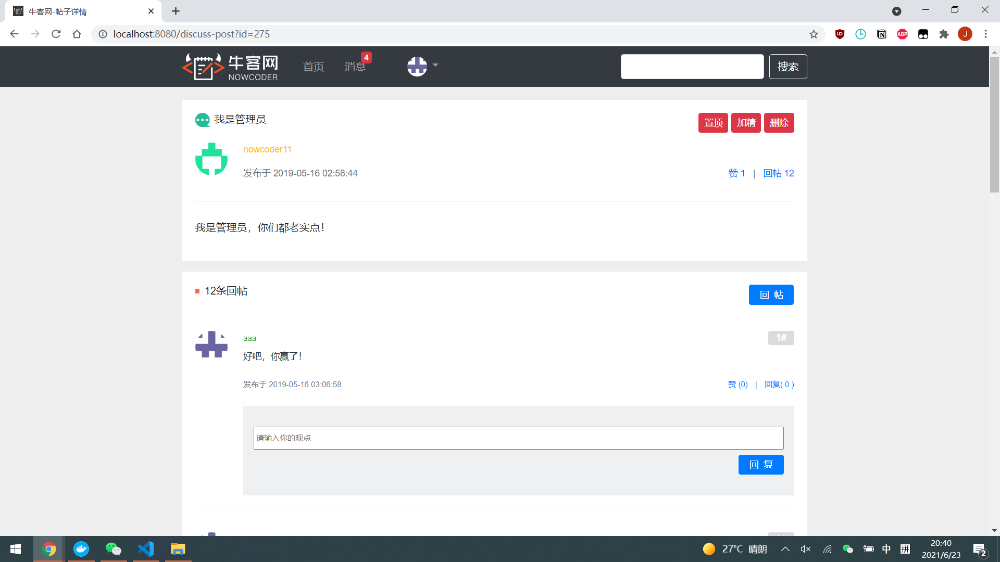
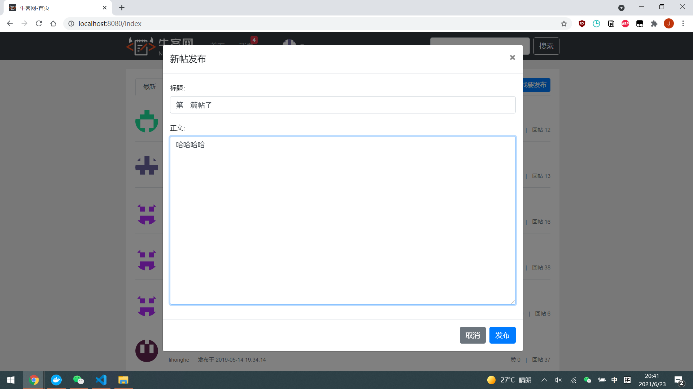
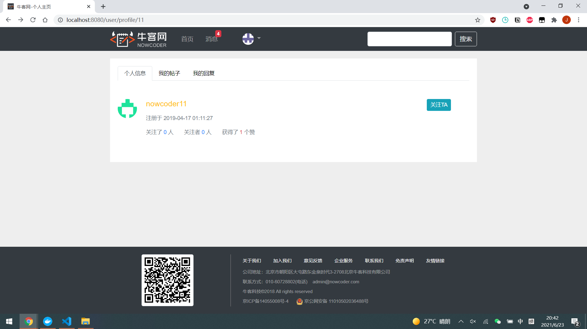
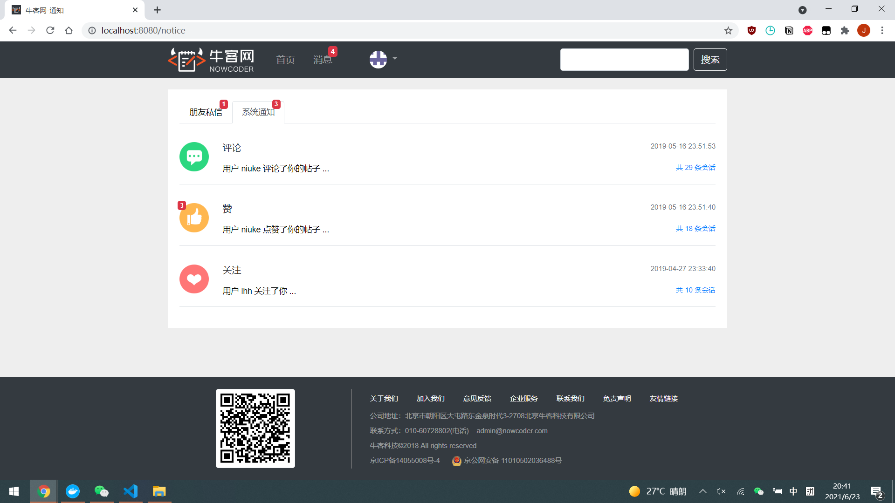
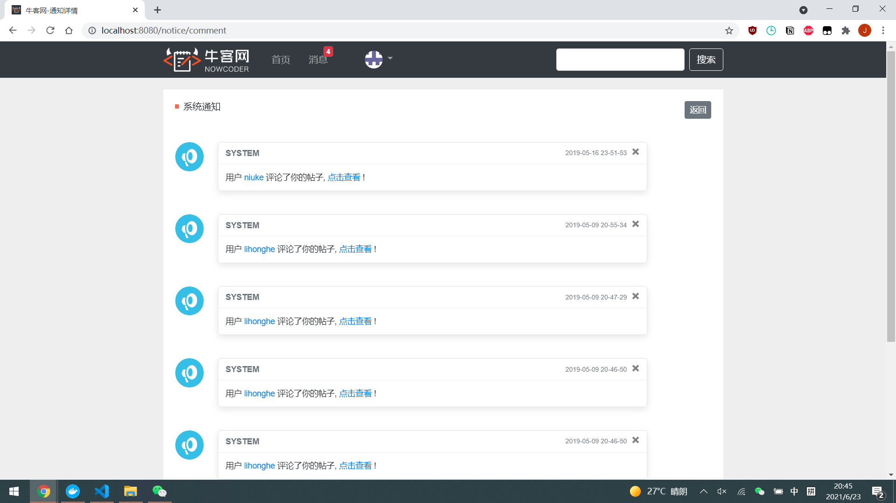

# Community

基于Spring Boot、Spring MVC、MyBatis实现的一个在线社区平台。实现了邮箱注册、验证码登录、发帖、评论、私信、点赞、关注等功能。

## 关键技术点

- 使用Redis中的set、zset、字符串分别存储点赞、关注用户token等信息，使用hash缓存频繁访问的对象。
- 基于Trie树实现敏感词过滤的功能，之后改为使用HashSet。时间复杂度从O(n)降低为O(1)。
- 使用Spring的AOP在每个Service被调用时打印日志。
- 向用户发送邮件来激活新注册的账户、修改账号的密码。

## 如何运行

### 基于docker运行

1. 克隆该项目到本地
`git clone https://github.com/shaojunying/community.git`
2. 进入项目根目录 `cd community`
3. 使用docker compose运行项目 `docker compose up -d`

### 命令行运行

#### 数据库

1. 安装Mysql 5.7
2. 执行`mysql-dump/init_1schema.sql`，创建表
3. 执行`mysql-dump/init_1schema.sql`，向表内填充数据。
4. 安装redis

#### 消息队列

1. 安装kafka 2.13-2.6.0

#### 第三种方式（推荐方式！！！）

1. 注释掉docker-compose.yml中app部分。
2. 之后执行`docker compose up -d`启动项目依赖的数据库、消息队列服务。
3. 本地调用`mvn clean package -DskipTests`打包项目
4. 运行`java -jar target/community-0.0.1-SNAPSHOT.jar` 在本地运行

## 其他

### 项目的修改日志

[修改日志](doc/CHANGELOG.md)

## 运行截图

### 网站首页

### 帖子详情页

### 发帖页面

### 个人中心页

### 私信列表页

### 与某人的聊天记录页

